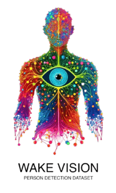

# Wake Vision Quickstart
[WakeVision.ai](https://wakevision.ai/)
## What is Wake Vision?
"Wake Vision" is a large, high-quality dataset featuring over 6 million images, significantly exceeding the scale and diversity of current tinyML datasets (100x). This dataset includes images with annotations of whether each image contains a person. Additionally, it incorporates a comprehensive fine-grained benchmark to assess fairness and robustness, covering perceived gender, perceived age, subject distance, lighting conditions, and depictions. Annotations are published under a CC BY 4.0 license, and all images are sourced from the Open Images v7 dataset under a CC BY 2.0 license.

## Colab
[Colab Link](https://colab.research.google.com/drive/1HC5lkBblrdRZ4vaT5M5061TKKep0MS-M?usp=sharing)

We provide a Colab to quickly interact with the dataset without downloading anything. 

## Quickstart
### Install Requirements
```
pip install -r requirements.txt
```

### Run Benchmark
The dataset will automatically download if you use HuggingFace Datasets. Currently, you need to build the [TFDS version](https://github.com/Ekhao/datasets/tree/wake_vision) of the dataset [manually](https://www.tensorflow.org/datasets/add_dataset).

```
python3 benchmark.py -m"example_wake_vision_mobilenetv2.keras" -d=$DATASET_DIR -t={"tfds", "hf"}
```

### Train a MobileNetV2_0.25 on Wake Vision
```
python3 train.py -m="Wake_Vision_MNV2.keras" -d=$DATASET_DIR -t={"tfds", "hf"}
```
